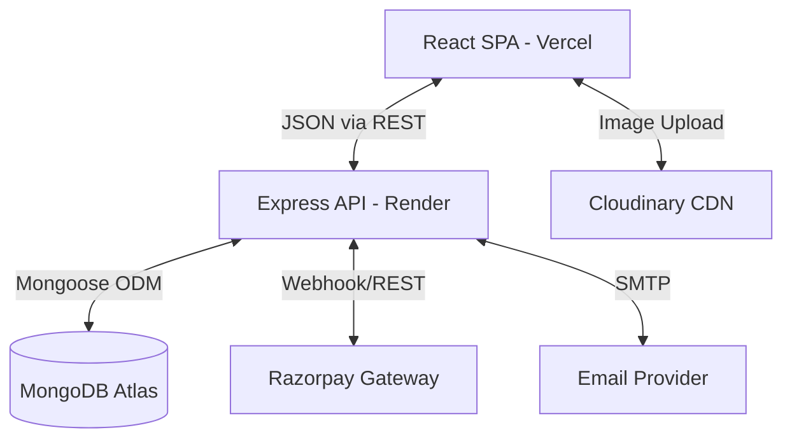

# Architecture Overview

Agriftilizer is built using the MERN stack (MongoDB, Express, React, Node.js) with a focus on modern eCommerce requirements and scalability.

## 1. System Architecture

The application is split into two primary decoupled tiers:
- **Client (Frontend)**: A Single Page Application (SPA) built with React.js, powered by Vite for rapid development and optimized builds.
- **Server (Backend)**: A RESTful JSON API built with Node.js and Express.js.

## 2. Frontend Architecture (React)

- **State Management**: 
  - `Redux Toolkit (RTK)` for global state (Auth).
  - `RTK Query` for data fetching, caching, and cache invalidation.
- **Routing**: `react-router-dom` using dynamic route matching and nested layouts.
- **Styling**: `Tailwind CSS` for utility-first styling.
- **Code Splitting**: Route-level code splitting using `React.lazy` and `Suspense` for performance optimization.

## 3. Backend Architecture (Express/Node)

- **Design Pattern**: MVC (Model-View-Controller).
  - `Models`: Mongoose schemas defining data structure and relationships.
  - `Controllers`: Business logic and request handling.
  - `Routes`: Endpoint definitions mapping to controllers.
  - `Middleware`: Authentication (JWT), Error Handling, Rate Limiting, File Upload (Multer).
- **Security**: Helmet, CORS, Express-Rate-Limit, bcryptjs for password hashing.
- **Logging**: Winston for structured local logging and file persistence (`app.log`, `error.log`).

## 4. DevOps & CI/CD
- **Docker**: Containerized environments for both development and production.
- **GitHub Actions**: Automated pipelines for linting, testing, and building the application on pushes to `main`.
- **Database Backups**: Automated Bash script dumping MongoDB data into GZIP archives.
